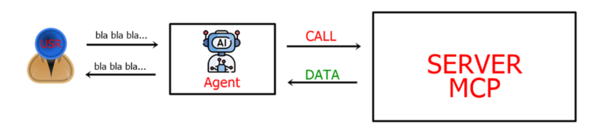

<h1 align="center"> FelipedelosH </h1>
<br>
<h4>MCP SERVER DEMO</h4>


<br>
:construction: Status of project :construction:
<br><br>
This project is a small example of an MCP server (Model Context Protocol) written in Python.
The server runs inside a Docker container and gives Claude Desktop. 
Claude Desktop can call this tool by talking to the Docker container through a standard input/output connection (stdio).
The server does not use the internet or a web server – it just waits for Claude to send a message and replies with a greeting.

This is the first step to build bigger tools, like managing users or points.

## :hammer:Funtions:

The MCP server exposes the following tools that Claude Desktop can invoke:

1. **`saludar(nombre: str = "mundo") -> str`**  
   Returns a greeting message: `"¡Hola, {nombre}!"`. Useful for testing the connection.

2. **`test_db_connection() -> dict`**  
   Tests the database connection and returns the list of tables in the `public` schema.  
   Returns `success: true/false`, database name, host, and the list of tables (if successful).

3. **`crear_usuario(nombre: str, email: str, phone: str = None, rappi_id: str = None) -> dict`**  
   Inserts a new user into the `users` table. Returns `exito: true` and the created user data, or an error message if the email already exists.

4. **`listar_usuarios(limite: int = 10) -> list`**  
   Retrieves the most recent users (up to `limite`) from the `users` table, ordered by ID descending. Returns a list of user dictionaries.

5. **`acumular_puntos(user_id: int, points: int) -> dict`**  
   Adds points to a user's accumulation record (`event_accumulations`).  
   - If the user exists and points are positive, it creates an accumulation record and an `OK` event in `events`.  
   - Otherwise, it returns an error and rolls back the transaction.

6. **`redimir_puntos(user_id: int, points: int) -> dict`**  
   Redeems points from a user (`event_redeems`).  
   - Similar to accumulation: checks user existence, inserts a redemption record, and creates an `OK` event.  
   - Returns success or error details.

# Architecture

```
rappi_mcp_project/
│
├── Docs/                           # Documentation and other files
│   └── init.sql                    # Table creation script
│   └── (other files: diagrams, explanations, etc.)
│
├── mcp-server/
│   ├── Dockerfile                   # To containerize the Python MCP server
│   ├── pyproject.toml               # Project configuration (dependencies, script)
│   └── main.py                      # MCP server code (tools)
│
├── docker-compose.yml               # Only for the Python service (your database runs separately)
├── .env                             # Environment variables (Postgres connection)
└── README.md                        # Full instructions
```

## :play_or_pause_button:How to execute a project

0. Prepare the database (First, start a PostgreSQL container and create tables Docs/DATABASE/init.sql)

1. Make sure you have Docker installed and running on your machine.

2. Build and start the MCP server container from the project root:
```
docker-compose up --build
```
3. Configure Claude Desktop to talk to the MCP server:
```
%APPDATA%\Claude\claude_desktop_config.json
```

```
{
  "mcpServers": {
    "rappi-demo": {
      "command": "docker",
      "args": [
        "compose",
        "-f",
        "C:\\full\\path\\to\\your\\docker-compose.yml",
        "run",
        "--rm",
        "-i",
        "mcp-server"
      ]
    }
  }
}
```

4. Test the connection by asking Claude:
```
Use the saludar tool with the name 'Claude'.
```
You should receive a response like: "¡Hola, Claude!"

## :hammer_and_wrench: Tech.

- Python 3.11+
- uv
- Docker & Docker Compose
- MCP & FastMCP 
- PostgreSQL
- psycopg2-binary

## :warning:Warning.

- Claude Desktop dependency – The server only works with Claude Desktop via stdio. It cannot be used as a standalone web API or with other MCP clients without modification.
- Windows‑specific paths – Configuration examples are written for Windows (%APPDATA%\Claude); users on macOS or Linux need to adapt the configuration file location.
- Manual configuration – The user must manually edit claude_desktop_config.json; there is no automated setup script.
- No multi‑server support – The demo connects only one MCP server to Claude Desktop.

## Autor

| [<br><sub>Andrés Felipe Hernánez</sub>](https://github.com/felipedelosh)|
| :---: |